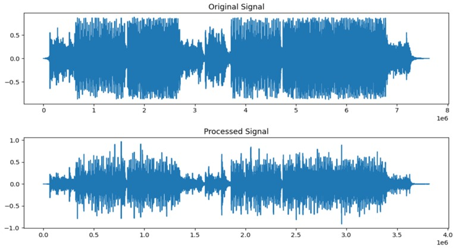
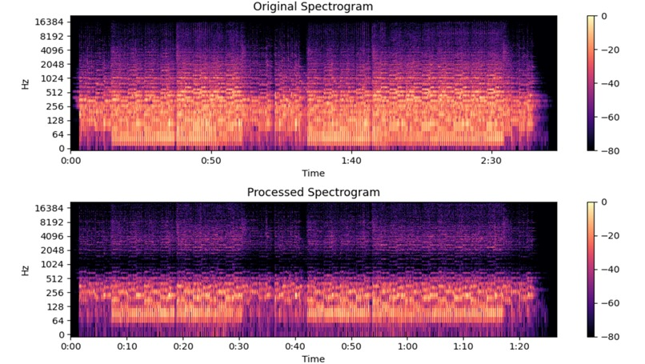
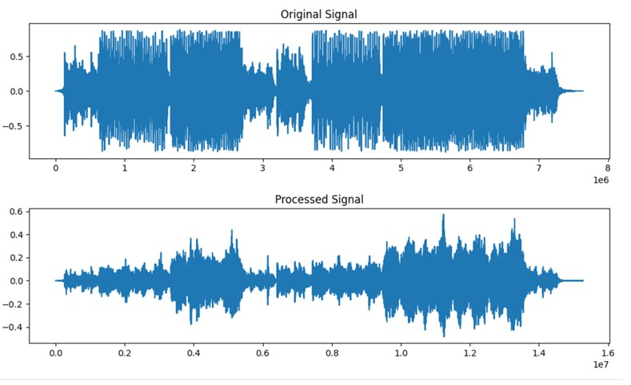
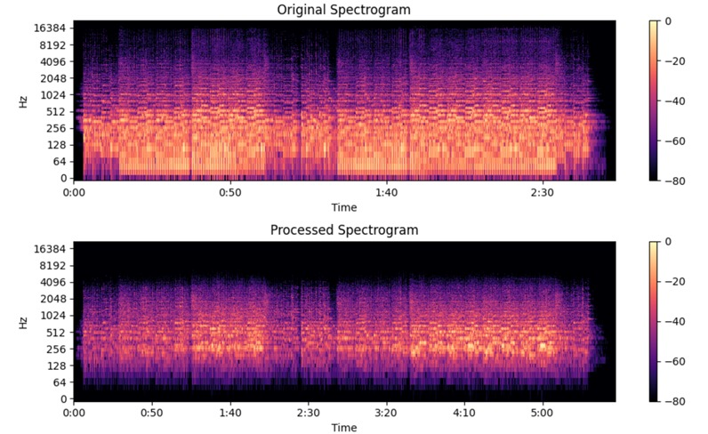

# 🎧 DSP Voice Changer

A Python-based Digital Signal Processing (DSP) application with a GUI that allows users to modify and analyze audio signals in real-time. The project integrates core DSP concepts such as spectral subtraction, phase vocoder, filtering, and convolution-based effects.

---

## 🚀 Features

- 🎵 **Pitch Shifting** (−12 to +12 semitones)
- ⏩ **Speed Control** (Time-stretching using Phase Vocoder)
- 🎚️ **3-Band Equalizer**
  - Low (0–300 Hz)
  - Mid (300–3000 Hz)
  - High (3000+ Hz)

- 🔇 **Noise Reduction** (Spectral Subtraction)
- 🔊 **Echo Effect** (Convolution-based reverb)
- 📊 **Visualization**
  - Waveforms (Original vs Processed)
  - Spectrograms (Log-frequency STFT)

- ▶️ **Playback and Save Output**

---

## 🧠 DSP Concepts Used

This project demonstrates practical implementation of:

- Short-Time Fourier Transform (STFT)
- Inverse STFT (ISTFT)
- Phase Vocoder (Time-stretching)
- Spectral Subtraction (Noise Reduction)
- Digital Filtering (Butterworth Filters)
- Convolution (Echo/Reverb)
- Frequency-domain analysis (Spectrograms)

---

## 🖥️ Tech Stack

- **Python**
- Libraries:
  - `librosa`
  - `numpy`
  - `matplotlib`
  - `scipy`
  - `sounddevice`
  - `soundfile`
  - `tkinter` (GUI)

---

## ⚙️ Installation

### 1. Clone the repository

```
git clone https://github.com/sanket-chakraborty/audio-dsp.git

cd audio-dsp
```

### 2. Install dependencies

```
pip install numpy matplotlib librosa scipy sounddevice soundfile
```

---

## ▶️ Usage

Run the application:

```
python main.py
```

### Steps:

1. Load a `.wav` file
2. Adjust:
   - Pitch
   - Speed
   - Equalizer (Low/Mid/High)
   - Toggle Noise Reduction / Echo

3. Click **Process**
4. Play or Save output
5. Visualize waveform or spectrogram

---

## 📊 Example Outputs

1. Pitch = 12, Speed = 2x, Low gain = 2, Mid gain = 0, High gain = 2, Noise reduction:-




2. Pitch = 0, Speed = 0.5x, Low gain = 0, Mid gain = 2, High gain = 0, Noise reduction, Echo effect:-




---

## 📌 Future Improvements

- Real-time audio processing
- GUI enhancements
- More advanced filters (FIR/IIR design)
- ML-based noise reduction
- Audio feature extraction (MFCC, etc.)

---

## 🎯 Learning Outcomes

- Hands-on understanding of DSP pipelines
- Practical implementation of frequency-domain processing
- Experience with scientific Python libraries
- Building GUI-based engineering tools

---

## 📄 License

This project is open-source and available under the MIT License.
